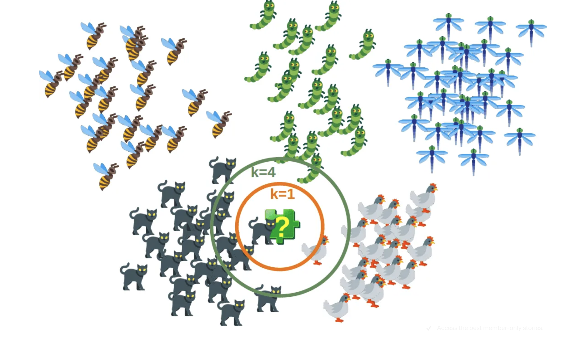

# Project Scope: German EV Charger Map Project (ChargeIT)

The German EV Charger Map Project is an ambitious undertaking aimed at simplifying electric vehicle (EV) charging across Germany. This project is a work in progress, with the goal of creating an application that streamlines the EV charging experience. By utilizing real-time data, route planning, and advanced EV range calculations, we aim to provide EV drivers with a valuable tool for their journeys. 


## Summary of German EV Charger Map Project:


Our project began with an extensive investigation of various data sources to gain insights into Germany's electric vehicle (EV) landscape and charging station status. This involved collecting data from publicly available datasets, governmental records, and charging network providers. We also analyzed market reports to understand EV adoption and types in Germany.

Once our data investigation was complete, we compiled a comprehensive list of charging stations across Germany. We integrated data from multiple sources into a structured database that includes essential details such as station locations, charging speeds, connector types, and real-time availability. To ensure data accuracy, we implemented stringent quality assurance measures, including data validation and regular updates.

We prioritized capturing precise location information for each charging station, collecting GPS coordinates to pinpoint their exact locations. These coordinates are crucial for creating an interactive map that allows users to easily locate charging stations. Our system also ensures regular updates to reflect any changes or new additions.

A key feature of our project is route planning and reach calculation. We've developed a sophisticated algorithm that considers user input, including the starting location, destination, and estimated EV range, to provide an overview of reachable charging stations along the selected route.

Through these efforts and by utilizing the kNN algorithm, we aim to provide a powerful tool for EV drivers in Germany. They can use our service to find charging stations and plan their routes while considering their EV's range. We continuously refine and expand our data sources and algorithms to enhance the accuracy and utility of our service.

## Libraries:
```
the libraries that we use for this project:
pandas
numpy
sklearn
geopy
folium
tkinter
```
## API: 
Here is the [Link for the wiki]([https://pages.github.com/](https://wiki.openstreetmap.org/wiki/DE:Hauptseite?uselang=de))
```
openstreetmap API for map route


```
## Algorithm: 
### kNN algorithm:


- We apply the kNN algorithm along the identified route. For each point on the route, the kNN algorithm helps us find the 'k' nearest charging stations.
- The 'k' value can be customized based on user preferences or system defaults. For example, if 'k' is set to 5, the algorithm will find the three nearest charging stations at each point along the route.
```
# we load the library 
from sklearn.neighbors import NearestNeighbors

# K-NN Algorithmus mit k=5 erstellen (um die nächstgelegenen 5 Stationen zu finden)
knn = NearestNeighbors(n_neighbors=5)
knn.fit(charging_stations)

```


## How to use the code: 
```
run app.ipynb file
then choose your python kernel
after that an UI will asked you about:
Startpunkt (Latitude of your startpoint)
Startpunkt (Longitude of your startpoint)
Zielpunkt (Latitude of your endtpoint)
Zielpunkt (Longitude of your endpoint)
Reichweite (reachlimit of your EV)
```
### Code:
```
under construction:
```


